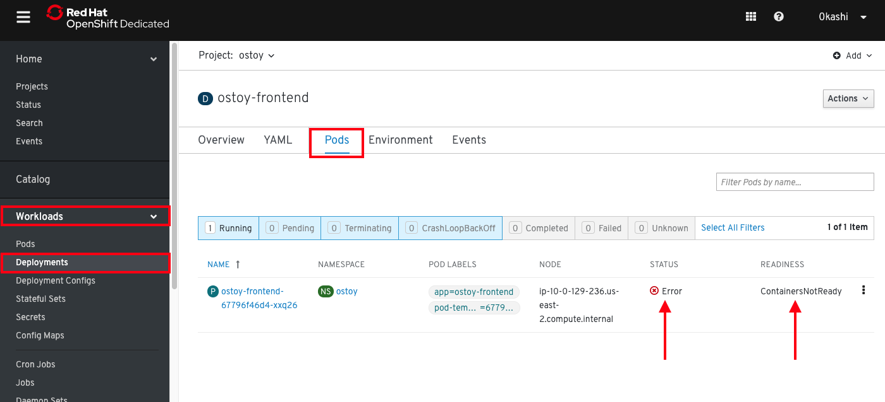

## Health Checks
In this section we will intentionally crash our pods, as well as make a pod non-responsive to the liveness probes and see how Kubernetes behaves.  We will first intentionally crash our pod and see that Kubernetes will self-heal by immediately spinning it back up. Then we will trigger the health check by stopping the response on the `/health` endpoint in our app. After three consecutive failures Kubernetes should kill the pod and then recreate it.

#### 1. Prepare the desktop
It would be best to prepare by splitting your screen between the OpenShift Web UI and the OSToy application so that you can see the results of our actions immediately.

But if the screen is too small or that just won't work, then open the OSToy application in another tab so you can quickly switch to OpenShift Web Console once you click the button. To get to this deployment in the OpenShift Web Console go to: 

*Workloads* > *Deployments* > *ostoy-frontend* > *Pods* 

#### 2. Intentionally crash the pod
Go to the OSToy app, click on *Home* in the left menu, and enter a message in the "Crash Pod" tile (ie: "This is goodbye!") and press the "Crash Pod" button.  This will cause the pod to crash and Kubernetes should restart the pod. After you press the button you will see:

#### 3. View the revival
Quickly switch to the Deployment - Pods screen (from step 1). You will see that the pod is in an error state, meaning it is down but should quickly come back up. (**Note:** this may happen quickly. If you are switching tabs you might miss it).

#### 4. Confirm
You can also check in the pod events (click on  *Home > Events* in the left nav) and further verify that the container has crashed and been restarted.

#### 5. Make the app malfunction
Keep the page from the pod events still open from step 4.  Then in the OSToy app click on the "Toggle Health" button, in the "Toggle Health Status" tile.  You will see the "Current Health" switch to "I'm not feeling all that well".

#### 6. Confirm
This will cause the app to stop responding with a "200 HTTP code". After 3 such consecutive failures ("A"), Kubernetes will kill the pod ("B") and restart it ("C"). Quickly switch back to the pod events tab and you will see that the liveness probe failed and the pod as being restarted.

