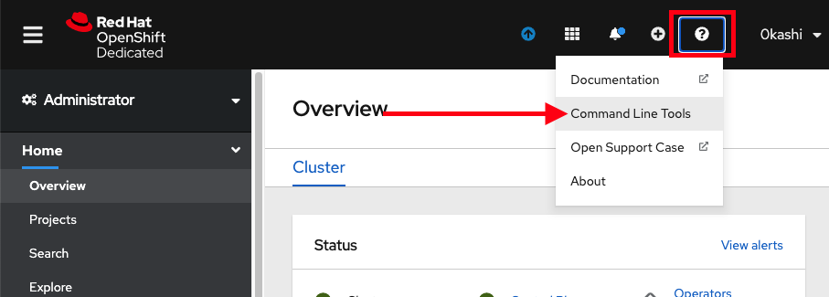

## Prerequisites

#### 1. An AWS Account
If you are using AWS organizations and you need to have a Service Control Policy (SCP) applied to the AWS account you plan to use, see the [Red Hat Requirements for Customer Cloud Subscriptions](https://www.openshift.com/dedicated/ccs#scp) for details on the minimum required SCP.

You will need the following pieces of information from your account:

- AWS IAM User
- AWS Access Key ID
- AWS Secret Access Key

#### 2. A Red Hat Account
If you do not already have a Red Hat account, [follow this link to create one](https://cloud.redhat.com/). Accept the required terms and conditions. Then, check your email for a verification link.

#### 3. AWS CLI
[Install the AWS CLI](https://docs.aws.amazon.com/cli/latest/userguide/install-cliv2.html) as per your operating system

#### 4. ROSA CLI
[Install the ROSA CLI](https://github.com/openshift/rosa/releases) as per your operating system. Download the relevant file for your operating system. Extract the file and store in a location within your "PATH". It is also advised to shorten the name to `rosa`.

#### 5. `oc` Command Line Interface
There are a few ways to install the `oc` cli.  
	- The simplest way is if you already have the `rosa` cli installed is to run `rosa `
	- You can [download and install](https://docs.openshift.com/container-platform/4.7/cli_reference/openshift_cli/getting-started-cli.html#installing-openshift-cli) the latest OpenShift CLI (oc).  
	- If you already have an OpenShift cluster you can access the command line tools page by clicking on the *Questionmark > Command Line Tools*:
	

**Why use `oc` over `kubectl`** 
Being Kubernetes, one can definitely use `kubectl` with their OpenShift cluster.  `oc` is specific to OpenShift in that it includes the standard set of features from `kubectl` plus additional support for OpenShift functionality.  See [Usage of oc and kubectl commands](https://docs.openshift.com/dedicated/4/cli_reference/openshift_cli/usage-oc-kubectl.html) for more details.

#### 6. Red Hat OpenShift Service on AWS Cluster
You will need an ROSA cluster in order to execute the lab with.  If you do not have one please see the [Creating an ROSA Cluster](1b-create_rosa.md) section.
