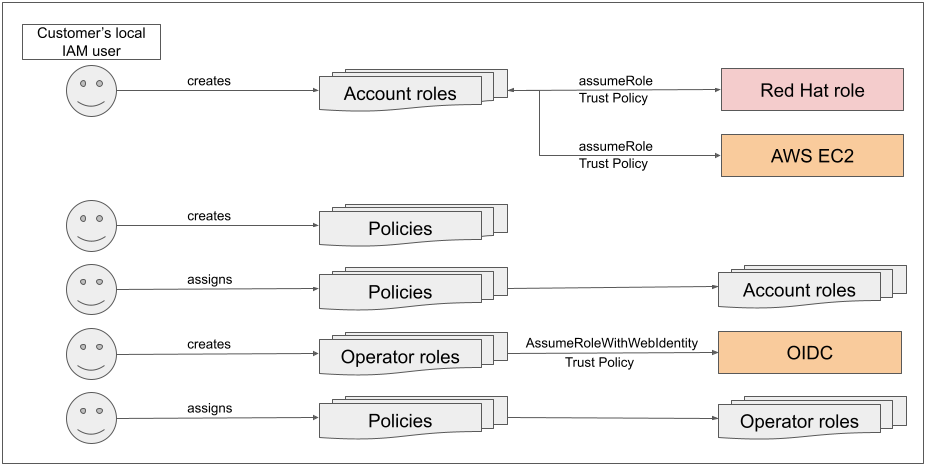
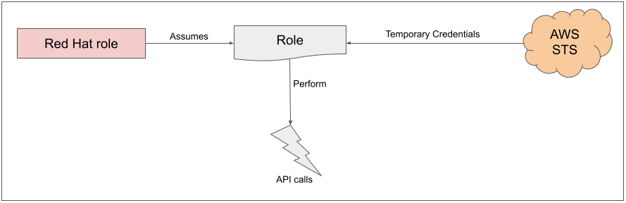
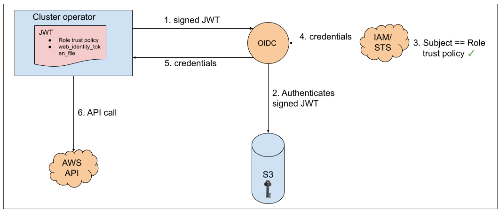

#ROSA with AWS STS Explained

##What is the goal of this page?
The goal of this page is to:

  - Enumerate the two main deployment options (ROSA with STS, ROSA with IAM users)
  - Explain the differences between them
  - Explain why STS is more secure and is the preferred option
  - Explain how ROSA with STS works

##What are the different “options” (credential methods) to deploy ROSA?
Since ROSA is a service that needs to manage infrastructure resources in your AWS account, the question is “how do you grant Red Hat the permissions needed in order to perform the required actions in your AWS account?”. That is what is meant by “options”. In the documentation, you might have seen references to deploying a ROSA cluster or deploying it “with STS” and you are wondering what the differences are.

So, there are currently two supported methods for granting those permissions:

  - Using static IAM user credentials with AdministratorAccess policy - “ROSA with IAM Users” (not recommended)
  - Using AWS Security Token Service (STS) with short-lived, dynamic tokens (preferred) - “ROSA with STS”

When ROSA was first released there was only one method, ROSA with IAM Users.  This method requires an IAM user with the AdministratorAccess policy (limited to the AWS account using ROSA) that allows the installer to create all the resources it needs, and allows the cluster to create/expand its own credentials as needed. Since then, we have been able to improve the service to implement security best practices and introduce a method that utilizes AWS STS. The STS method uses predefined roles and policies to grant the service minimal permissions needed (least-privilege) to the AWS account in order to create and operate the cluster. While both methods are currently enabled, the “ROSA with STS” method is the preferred and recommended option.

##What is AWS STS (Security Token Service)?
As stated in the [AWS documentation](https://docs.aws.amazon.com/STS/latest/APIReference/welcome.html) AWS STS “enables you to request temporary, limited-privilege credentials for AWS Identity and Access Management (IAM) users or for users you authenticate (federated users)”. In this case AWS STS can be used to grant the ROSA service, limited, short term access, to resources in your AWS account. After these credentials expire (typically an hour after being requested), they are no longer recognized by AWS and they no longer have any kind of account access from API requests made with them.

##What makes this more secure?
1. Explicit and limited set of roles and policies - the user creates them ahead of time and knows exactly every permission asked for and every role used.
1. The service cannot do anything outside of those permissions.
1. Whenever the service needs to perform an action it obtains credentials that will expire in at most 1 hour. Meaning there is no need to rotate or revoke credentials and their expiration reduces the risks of credentials leaking and being reused.

##How does ROSA use STS?
ROSA uses STS to grant permissions defined as least-privilege policies to specific and segregated IAM roles with short-term security credentials. These credentials are associated to the IAM roles that are specific to each component and cluster that makes AWS API calls. This better aligns with principles of least-privilege and is much better aligned to secure practices in cloud service resource management. The ROSA CLI tool manages the STS roles and policies that are assigned for unique tasks and takes action upon AWS resources as part of OpenShift functionality. One drawback of using STS is that roles and policies must be created for each ROSA cluster. To make this even easier, the installation tools provide all the commands and files needed to create them, as well as an option to allow the CLI to perform the creation of these roles and policies automatically using automatic mode.  Please see the [ROSA documentation](https://docs.openshift.com/rosa/rosa_install_access_delete_clusters/rosa-sts-creating-a-cluster-with-customizations.html#rosa-sts-creating-cluster-customizations_rosa-sts-creating-a-cluster-with-customizations) for more information about the different `--mode` options.

##What are the components that are specific to ROSA with STS?
  1. **AWS Infrastructure** - This provides the infrastructure required for the cluster. This will contain the actual EC2 instances, storage, and networking components. You can see [AWS compute types](https://docs.openshift.com/rosa/rosa_architecture/rosa_policy_service_definition/rosa-service-definition.html#rosa-sdpolicy-aws-compute-types_rosa-service-definition) to see supported instance types for compute nodes and the [provisioned AWS infrastructure](https://docs.openshift.com/rosa/rosa_planning/rosa-sts-aws-prereqs.html#rosa-ec2-instances_rosa-sts-aws-prereqs) section for the control plane and infrastructure nodes configuration.
  1. **AWS STS** - see the above section “[What is AWS STS?](#what-is-aws-sts-security-token-service)”.
  1. **Roles and policies** - It could be argued that this is the main component that differentiates “ROSA with STS” from “ROSA with IAM users”. The roles and policies that are used by ROSA are broken up into account-wide roles and policies, and operator roles and policies.

    The policies determine the allowed actions for each of the roles (permissions policies). Policies *b.v* through *b.x* below will be used by the cluster operator roles (in part c.) which are created in a second step (since they are dependent on an existing cluster name which is why they are not created at the same time as the account-wide roles). Please see the [documentation](https://docs.openshift.com/rosa/rosa_architecture/rosa-sts-about-iam-resources.html) for more details about the individual roles and policies.

      1. The account-wide roles are:
        1. ManagedOpenShift-Installer-Role
        1. ManagedOpenShift-ControlPlane-Role
        1. ManagedOpenShift-Worker-Role
        1. ManagedOpenShift-Support-Role
      1. The account-wide policies are:
        1. ManagedOpenShift-Installer-Role-Policy
        1. ManagedOpenShift-ControlPlane-Role-Policy
        1. ManagedOpenShift-Worker-Role-Policy
        1. ManagedOpenShift-Support-Role-Policy
        1. ManagedOpenShift-openshift-ingress-operator-cloud-credentials
        1. ManagedOpenShift-openshift-cluster-csi-drivers-ebs-cloud-credent
        1. ManagedOpenShift-openshift-cloud-network-config-controller-cloud
        1. ManagedOpenShift-openshift-machine-api-aws-cloud-credentials
        1. ManagedOpenShift-openshift-cloud-credential-operator-cloud-crede
        1. ManagedOpenShift-openshift-image-registry-installer-cloud-creden
      1. The operator roles are:
        1. <cluster-name\>-xxxx-openshift-cluster-csi-drivers-ebs-cloud-credent
        1. <cluster-name\>-xxxx-openshift-cloud-network-config-controller-cloud
        1. <cluster-name\>-xxxx-openshift-machine-api-aws-cloud-credentials
        1. <cluster-name\>-xxxx-openshift-cloud-credential-operator-cloud-crede
        1. <cluster-name\>-xxxx-openshift-image-registry-installer-cloud-creden
        1. <cluster-name\>-xxxx-openshift-ingress-operator-cloud-credentials
      1. Trust policies are created for each account-wide and operator role.

  1. **OIDC** - Provides a mechanism for cluster operators to authenticate with AWS in order to assume the cluster roles (via a trust policy) and obtain temporary credentials from STS in order to make the required API calls.

##What is the process for deploying a ROSA cluster that uses STS?
While reading the steps below, please do not become intimidated. You are not expected to create these resources from scratch. The ROSA CLI will create the required JSON files for you, and will output the commands you need to run. The ROSA CLI can also take this a step further and do it all for you, if desired.  The steps are:

  1. Create the account-wide roles and policies
  1. Assign the permissions policy to the corresponding role
  1. Create the cluster
  1. Create the operator roles
  1. Assign the permission policy to the corresponding operator roles.
  1. Create the OIDC provider
  1. Cluster is created. Done.

These roles and policies can be created automatically by the ROSA CLI or they can be manually created by utilizing the `--mode manual` or `--mode auto` flags in the ROSA CLI. See the documentation for details about the [modes](https://docs.openshift.com/rosa/rosa_install_access_delete_clusters/rosa-sts-creating-a-cluster-with-customizations.html#rosa-sts-creating-cluster-customizations_rosa-sts-creating-a-cluster-with-customizations), or see the [Deploy the cluster](2-deploy.md) section in this workshop as well.

##How does ROSA with STS work?
To get started, the user, using their local AWS user, will create the required account-wide roles and account-wide policies (see the [components](#what-are-the-components-that-are-specific-to-rosa-with-sts) section above). As a part of creating these roles a trust policy will be created which allows a Red Hat owned role to assume these roles (cross-account trust policy). Trust policies will also be created for the EC2 service (allowing workloads on EC2 instances to assume roles and get credentials). Then the user will assign to each role its corresponding permissions policy.

After the account-wide roles and policies are created we must proceed with creating the cluster. Once the cluster creation has been initiated, the operator related roles can be created so that the operators on the cluster can make AWS API calls. These roles are then assigned to their corresponding permission policies that were created earlier, along with a trust policy to an OIDC provider. These roles are a bit different from the account-wide roles in that they represent the operators on the cluster (which ultimately are pods) that need access to AWS resources.  Now, we cannot attach IAM roles to pods, so we need to create a trust policy with an OIDC provider so that the pods (comprising the operator) can have access to the roles they need.

Once we’ve assigned the roles to the corresponding policy permissions, the final step is to create the OIDC provider.

After this process has completed, when a role is needed, the workload, currently using the Red Hat role, will assume the role in the AWS account, obtain temporary credentials from AWS STS and begin performing the actions (via API calls) within the customer's AWS account as permitted by the assumed role’s permissions policy.  It should be noted that these credentials are temporary and have a maximum duration of 1 hour.

Placing this all together we can see the following flow and relationships:

Operators in the cluster use the following process to get credentials in order to perform their required tasks. As we saw above, each operator has an operator role, a permissions policy and a trust policy with an OIDC provider. The operator will assume-role by passing a JWT that contains the role and a token file (web_identity_token_file) to the OIDC provider, which then authenticates the signed key with a public key (created at cluster creation time and was stored in an S3 bucket). It will then confirm that the subject in the signed token file that was sent matches the role in the role trust policy (this way we ensure you only can get the role allowed).  Then it will return the temporary credentials to the operator so that it can make AWS API calls.  Here is an illustration of this concept:

To illustrate how this works, let's take a look at two examples:

  1. **How nodes are created at cluster install** - The installer, using the _RH-Managed-OpenShift-Installer_ role would assume the role of _Managed-OpenShift-Installer-Role_ within the customers account (via the trust policy) which returns temporary credentials from AWS STS.  Red Hat (the installer) would then begin making the required API calls (with the temporary credentials just received from STS) to create the infrastructure required in AWS. The same process would apply for support. Just in this case there would be an SRE instead of the installer.
  1. **Scaling out the cluster** - the _machine-api-operator_ will assume-role (AssumeRoleWithWebIdentity) for the _machine-api-aws-cloud-credentials_ role.  This would launch the sequence described above for the cluster operators and then it would receive the credentials. The _machine-api-operator_ can now make the relevant API calls to add more EC2 instances to the cluster.

##Wrapping up
We have seen the options for allowing the ROSA service to interact with resources in a user's AWS account and reviewed why AWS STS is the preferred and more secure method. Additionally we have looked at the detailed components and processes that ROSA with STS uses in order to obtain the credentials it needs.
