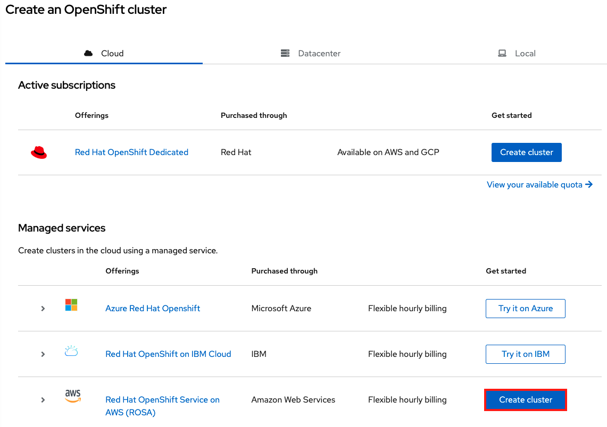
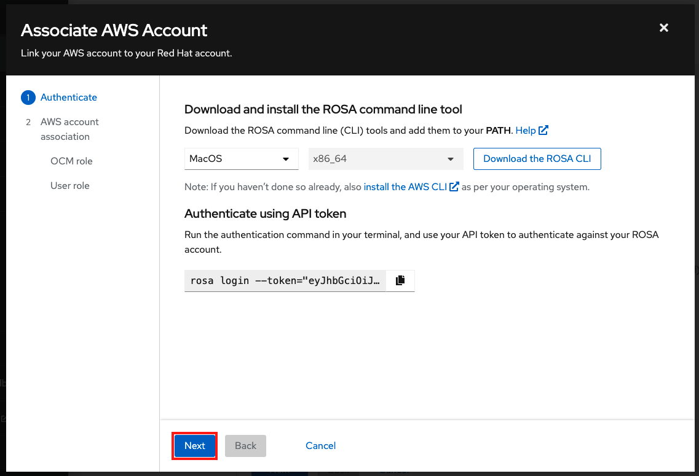
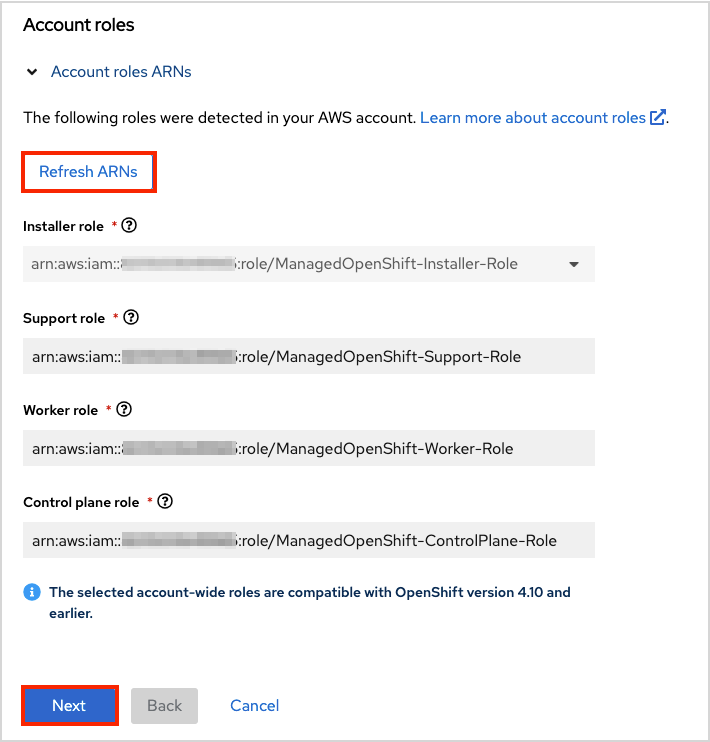
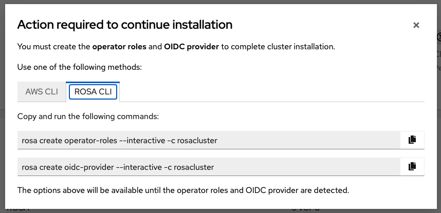

This page will take you through the steps to deploy a ROSA cluster using the OpenShift Cluster Manager (OCM) User Interface. If you'd prefer using the CLI for deploying your cluster, please see the [ROSA CLI](/rosa/2-deploy) page.


## Deployment flow
The overall flow that we will follow boils down to these steps. Step 1 only needs to be performed the *first time* you are deploying into an AWS account. Step 2 only needs to be performed the first time you are using the user interface. So for each successive cluster of the same y-stream version, you would just create the cluster.

1. Create the account wide roles and policies
1. Associate your AWS account with your Red Hat account
    1. Create and link OCM role
    1. Create and link User role
1. Create the cluster


## Create account wide roles

!!! note
    If you already have account roles (possibly from an earlier deployment) then skip this step. You will see that the UI will detect your existing roles after you select an associated AWS account.

If this is the <u>first time</u> you are deploying ROSA in this account and have <u>not yet created the account roles</u>, then create the account-wide roles and policies, including Operator policies.

In your terminal run the following command to create the account-wide roles:

```
rosa create account-roles --mode auto --yes
```

You will see an output like the following:

```
I: Creating roles using 'arn:aws:iam::000000000000:user/rosa-user'
I: Created role 'ManagedOpenShift-ControlPlane-Role' with ARN 'arn:aws:iam::000000000000:role/ManagedOpenShift-ControlPlane-Role'
I: Created role 'ManagedOpenShift-Worker-Role' with ARN 'arn:aws:iam::000000000000:role/ManagedOpenShift-Worker-Role'
I: Created role 'ManagedOpenShift-Support-Role' with ARN 'arn:aws:iam::000000000000:role/ManagedOpenShift-Support-Role'
I: Created role 'ManagedOpenShift-Installer-Role' with ARN 'arn:aws:iam::000000000000:role/ManagedOpenShift-Installer-Role'
I: Created policy with ARN 'arn:aws:iam::000000000000:policy/ManagedOpenShift-openshift-machine-api-aws-cloud-credentials'
I: Created policy with ARN 'arn:aws:iam::000000000000:policy/ManagedOpenShift-openshift-cloud-credential-operator-cloud-crede'
I: Created policy with ARN 'arn:aws:iam::000000000000:policy/ManagedOpenShift-openshift-image-registry-installer-cloud-creden'
I: Created policy with ARN 'arn:aws:iam::000000000000:policy/ManagedOpenShift-openshift-ingress-operator-cloud-credentials'
I: Created policy with ARN 'arn:aws:iam::000000000000:policy/ManagedOpenShift-openshift-cluster-csi-drivers-ebs-cloud-credent'
I: To create a cluster with these roles, run the following command:
rosa create cluster --sts
```

## Associate your AWS account with your Red Hat account

!!! note
    If you have already associated AWS accounts that you want to use, please skip this step.

The next step is to tell OCM what is/are your AWS account(s) that you want to use for deploying ROSA into.

Open OCM by visiting [https://console.redhat.com/openshift](https://console.redhat.com/openshift) and log in to your Red Hat account.

Click on the "Create Cluster" button.

Then in the ROSA row (about midway down the page, under "Managed services") click on the "Create Cluster" button.



Check the box stating that you have read and completed all the prerequisites.

Then click the dropbox under "Associated AWS account". You may see that there are no associated accounts. This is expected since we have not associated any AWS accounts yet. Click on the box that says "Associate AWS account".


A pop up window will open instructing you to download the ROSA CLI, AWS CLI, and to log into your Red Hat account. If you have been following this workshop we already did this in the previous [Setup](/rosa/1-account_setup/) section, so just click "Next".



On the next page you will see the commands to create the OCM role for the level of permissions that this role will have. You can create:

- **Basic OCM role**: Allows OCM to have read only access to the account in order to check if the roles and policies that are required by ROSA are present before creating a cluster. You will need to manually create the required roles, policies and OIDC provider using the CLI.
- **Admin OCM role**: Grants OCM additional permissions in order to create the required roles, policies, and OIDC provider for ROSA. Using this makes the deployment of a ROSA cluster quicker since OCM will be able to create the required resources for you avoiding the need for you to manually create them.

To read more about these roles, please click the tooltip or visit the [OpenShift Cluster Manager roles and permissions](https://docs.openshift.com/rosa/rosa_architecture/rosa-sts-about-iam-resources.html#rosa-sts-ocm-roles-and-permissions_rosa-sts-about-iam-resources) section of the documentation.

For the purposes of this workshop, we'll use the Admin OCM role since we want the simplest and quickest approach.

### Create and associate an OCM role

You can copy the command for the Admin OCM role from that window which will launch interactive mode. Or for simplicity switch to your terminal and execute:

```
rosa create ocm-role --mode auto --admin --yes
```

This will create the OCM roles for you and associate them with your Red Hat account.

```
I: Creating ocm role
I: Creating role using 'arn:aws:iam::000000000000:user/rosa-user'
I: Created role 'ManagedOpenShift-OCM-Role-12561000' with ARN 'arn:aws:iam::000000000000:role/ManagedOpenShift-OCM-Role-12561000'
I: Linking OCM role
I: Successfully linked role-arn 'arn:aws:iam::000000000000:role/ManagedOpenShift-OCM-Role-12561000' with organization account '1MpZfntsZeUdjWHg7XRgP000000'
```  

!!! note
    As an alternative, you can define `--mode manual` if you'd prefer to execute the AWS CLI commands yourself. The AWS commands will be outputted to the CLI and the relevant JSON files will be created in the current directory.  Also make sure to link the role as well which is the last command outputted. Also, if you insist on creating a Basic OCM role, then just remove `--admin` from the command above.

Click "Next".

### Create an OCM User role

As defined in the [documentation](https://docs.openshift.com/rosa/rosa_architecture/rosa-sts-about-iam-resources.html#rosa-sts-understanding-user-role_rosa-sts-about-iam-resources) the user role needs to be created so that the ROSA service can verify your AWS identity. This role has no permissions, and it is only used to create a trust relationship between the installer account and your OCM role resources.

Run the following to create the User Role and to link it to your Red Hat account.

```
rosa create user-role --mode auto --yes
```

You will see a response like

```
I: Creating User role
I: Creating ocm user role using 'arn:aws:iam::000000000000:user/rosa-user'
I: Created role 'ManagedOpenShift-User-rosa-user-Role' with ARN 'arn:aws:iam::000000000000:role/ManagedOpenShift-User-rosa-user-Role'
I: Linking User role
I: Successfully linked role ARN 'arn:aws:iam::000000000000:role/ManagedOpenShift-User-rosa-user-Role' with account '1rbOQez0z5j1YolInhcXY000000'
```

!!! note
    As before, you can define `--mode manual` if you'd prefer to execute the AWS CLI commands yourself. The AWS commands will be outputted to the CLI and the relevant JSON files will be created in the current directory.  Also make sure to link the role as well which is the last command outputted.

Click "Ok".

### Confirm successful association

You will be brought back to the original window in which you should see your AWS account that you associated above in the drop down.  If you see your account there, it was successful.

Select the account.


You will then see the account role ARNs (created earlier) populated below.



Click "Next".

## Create the cluster

For the purposes of this workshop make the following selections.

### Cluster settings

Details:

- Cluster name: **<pick a name\>**
- Version: **<select latest version\>**
- Region: **<select desired region\>**
- Availability: **Single zone**
- Enable user workload monitoring: **leave checked**
- Enable additional etcd encryption: **leave unchecked**
- Encrypt persistent volumes with customer keys: **leave unchecked**

Click "Next".

Machine pool (leave the defaults which are):

- Compute node instance type: **m5.xlarge - 4 vCPU 16 GiB RAM**
- Enable autoscaling: **unchecked**
- Compute node count: **2**
- Leave node labels blank

Click "Next".

### Networking

Configuration - Leave all default values

Click "Next".

CIDR ranges - Leave all default values

Click "Next".

### Cluster roles and policies
For the purposes of this workshop leave "Auto" selected and it will make the cluster deployment process simpler and quicker.

!!! note
    If you selected a Basic OCM role earlier you can only use manual mode and you must manually create the operator roles and OIDC provider.  See "For Basic OCM roles only" section below after you've completed the "Cluster updates" section and started the cluster creation.

### Cluster updates
Leave all the default options.

### Review and create
Review the content for the cluster configuration and click "Create cluster".

### Monitor installation progress
Stay at the current page to monitor the installation progress.


Once the installation is complete, continue to the next step [Create an admin user](/rosa/3-create_initial_admin).

## For Basic OCM Role only
If you created an Admin OCM role as directed above **please ignore** this entire section since OCM will create it for you.

### Create operator roles

If you created a Basic OCM Role earlier, you will need to manually create 2 more elements before the cluster installation can continue.

- Operator roles
- OIDC provider

!!! note
    To understand what these do, please see the [ROSA with AWS STS Explained](/rosa/15-sts_explained/) section.

There will be a pop up window that will show you the commands to run.



In your terminal, you may run the commands from the window which will launch interactive mode. Though for simplicity, run the following to create the Operator roles:

```
rosa create operator-roles --mode auto --cluster <cluster-name> --yes
```

You will see a response like:
```
I: Creating roles using 'arn:aws:iam::000000000000:user/rosauser'
I: Created role 'rosacluster-b736-openshift-ingress-operator-cloud-credentials' with ARN 'arn:aws:iam::000000000000:role/rosacluster-b736-openshift-ingress-operator-cloud-credentials'
I: Created role 'rosacluster-b736-openshift-cluster-csi-drivers-ebs-cloud-credent' with ARN 'arn:aws:iam::000000000000:role/rosacluster-b736-openshift-cluster-csi-drivers-ebs-cloud-credent'
I: Created role 'rosacluster-b736-openshift-cloud-network-config-controller-cloud' with ARN 'arn:aws:iam::000000000000:role/rosacluster-b736-openshift-cloud-network-config-controller-cloud'
I: Created role 'rosacluster-b736-openshift-machine-api-aws-cloud-credentials' with ARN 'arn:aws:iam::000000000000:role/rosacluster-b736-openshift-machine-api-aws-cloud-credentials'
I: Created role 'rosacluster-b736-openshift-cloud-credential-operator-cloud-crede' with ARN 'arn:aws:iam::000000000000:role/rosacluster-b736-openshift-cloud-credential-operator-cloud-crede'
I: Created role 'rosacluster-b736-openshift-image-registry-installer-cloud-creden' with ARN 'arn:aws:iam::000000000000:role/rosacluster-b736-openshift-image-registry-installer-cloud-creden'
```

### Create OIDC provider

In your terminal run the following to create the Operator roles:

```
rosa create oidc-provider --mode auto --cluster <cluster-name> --yes
```

You will see a response like:
```
I: Creating OIDC provider using 'arn:aws:iam::000000000000:user/rosauser'
I: Created OIDC provider with ARN 'arn:aws:iam::000000000000:oidc-provider/rh-oidc.s3.us-east-1.amazonaws.com/1tt4kvrr2kha2rgs8gjfvf0000000000'
```

*[ROSA]: Red Hat OpenShift Service on AWS
*[STS]: AWS Security Token Service
*[OCM]: OpenShift Cluster Manager
