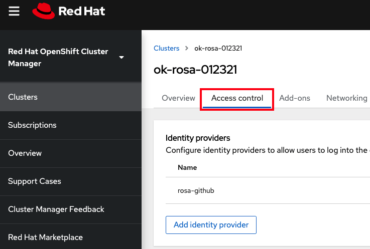
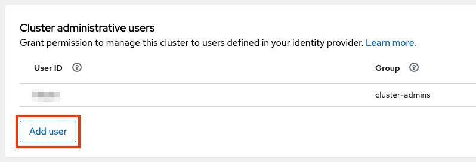

##  Granting admin rights to users

#### Granting cluster-admin rights
Cluster admin rights are not automatically granted to any new users that you add to the cluster.  If there are new users that you want to grant this level of privilege to you will need to manually add it to each user.  Let's start off with granting it to ourselves using the GitHub username we just created for the cluster.

1. Via `rosa` CLI
    1. Assuming you are logged into `oc` with the admin user we created earlier you can enable cluster admin for the cluster by running

        `rosa edit cluster <cluster_name> --enable-cluster-admins`

    1. Give our GitHub username cluster-admin access by running

        `rosa grant user cluster-admin --user <idp_user_name> --cluster=<cluster_name>`

    1. Verify that we were added as a cluster-admin by running

        `rosa list users --cluster=<cluster-name>`

        You should see your GitHub ID of the user listed.

            $ rosa list users --cluster=my-rosa-cluster
            ID        GROUPS
            <user>    cluster-admins

    1. Logout and log back into the cluster to see a new perspective with the “Administrator Panel”. (You might need to try an Incognito/Private window)

        

1. Via OCM UI
    1. Log into OCM from <https://cloud.redhat.com/openshift>
    1. Select your cluster
    1. Click on the “Access Control” tab

        

    1. Towards the bottom in the “Cluster Administrative Users” section click on “Add User”

        

    1. On the pop-up screen enter the person's user ID (in our example the GitHub ID)
    1. Select whether you want to grant them cluster-admin or dedicated-admin

        

#### Granting dedicated-admin
ROSA has a concept of an admin user that can complete most administrative tasks but is slightly limited to prevent anything damaging.  It is called a “dedicated-admin” role.  It is best practice to use dedicated admin when elevated privileges are needed.  You can read more about it [here](https://access.redhat.com/documentation/en-us/openshift_dedicated/4/html-single/authentication/index#dedicated-admin-role-overview_understanding-service-accounts).

1. Enter the following command to promote your user to a dedicated-admin

    `rosa grant user dedicated-admin --user <idp_user_name> --cluster <cluster_name>`

1. Enter the following command to verify that your user now has dedicated-admin access

    `oc get groups dedicated-admins`

1. You can also grant dedicated-admin rights via the OCM UI as described in the cluster-admin section, but just select the “dedicated-admins” radio button instead.

*[ROSA]: Red Hat OpenShift Service on AWS
*[IdP]: Identity Provider
*[OCM]: OpenShift Cluster Manager