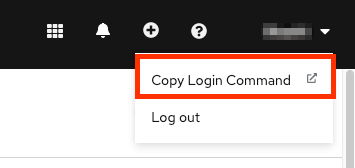
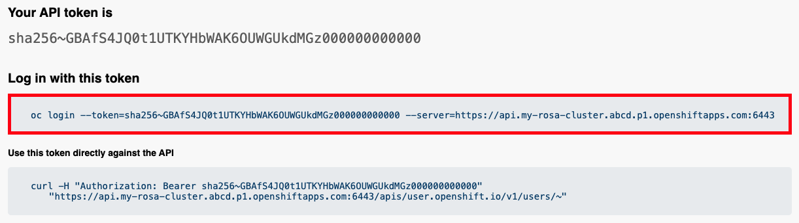

## Accessing the cluster
There are multiple ways to interact with your cluster.  You can connect to it via the CLI or via the Web Console. We will review both options below.

#### Accessing the cluster via the Web Console
1. Copy the url provided from the previous step where we set up the IdP and paste it into your web browser.  It will be in the format of <https://console-openshift-console.apps.my-rosa-cluster.abcd.p1.openshiftapps.com> 
1. Click on your IdP.  In the guide we created “rosa-github”.

    

1. Enter your GitHub user credentials (or other credentials if not using GitHub)
1. You should be logged in. If you followed these guides in order, you will be a cluster-admin and should see a web console like the following with the "Administrator" panel visible.

    

#### Accessing the cluster via the CLI
In order to access the cluster via the CLI you must have the `oc` command installed.  Which if you followed the previous steps you already have.

1. Log into the web console as stated above.
1. Click on your username in the top right corner
1. Click on “Copy Login Command”

    

1. This will open a new tab with a choice of IdP. Click on the IdP you want to use, in our case, “rosa-github”.
1. A new tab will open, Click on “Display token”.
1. You will see a page like the following

    

1. Copy the `oc login` command and paste it into your terminal. Press enter

        $ oc login --token=sha256~GBAfS4JQ0t1UTKYHbWAK6OUWGUkdMGz000000000000 --server=https://api.my-rosa-cluster.abcd.p1.openshiftapps.com:6443
        Logged into "https://api.my-rosa-cluster.abcd.p1.openshiftapps.com:6443" as "rosa-user" using the token provided.
        
        You have access to 79 projects, the list has been suppressed. You can list all projects with ' projects'
        
        Using project "default".

1. We can confirm that we are now the user we logged in with by running `oc whoami`

        $ oc whoami
        rosa-user

1. We can now start using our cluster.

*[ROSA]: Red Hat OpenShift Service on AWS
*[IdP]: Identity Provider
*[OCM]: OpenShift Cluster Manager