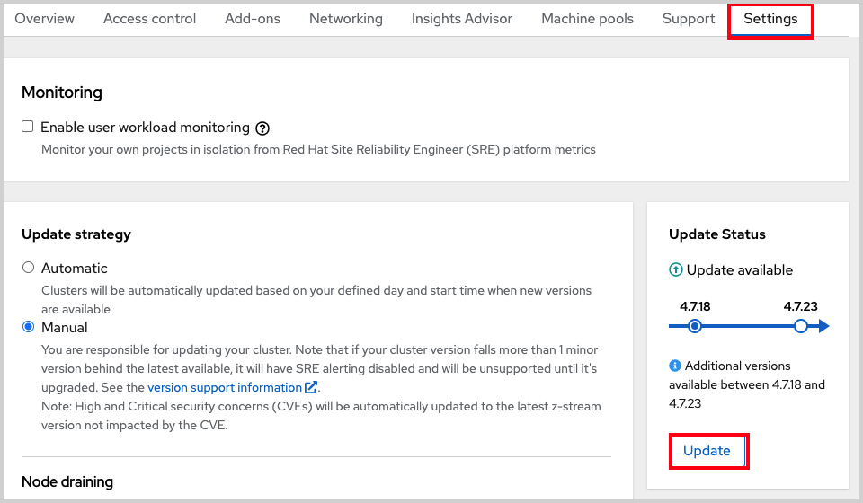

## Upgrading the cluster

All upgrades are fully executed by the service for your cluster (meaning that you won't need to execute any commands or make changes to the cluster) though you have choices on scheduling them.

There are 3 ways to upgrade your cluster.

- **Manually via the CLI** - Start a one-time immediate upgrade or schedule a one-time upgrade for a future date/time.
- **Manually via the OCM UI** - Start a one-time immediate upgrade or schedule a one-time upgrade for a future date/time.
- **Automated upgrades** - Set an upgrade window for recurring y-stream upgrades whenever a new version is available without needing to manually schedule it (Ex: Saturday at 06:00 UTC). Minor versions have to be manually scheduled.

We will go through these three scenarios.

You can always use `--help` for more details like

	rosa upgrade cluster --help

#### Manually via the CLI
1. Check if there is an upgrade available by running the following command

		rosa list upgrade -c <cluster-name>

	You will get a list that shows the available version and the current version of your cluster.  For example:

    	$ rosa list upgrade -c <cluster-name>
    	VERSION  NOTES
    	4.10.20   recommended
    	4.10.18
    	...

    In our example we see that version 4.10.18 is available and so is 4.10.20.

1. Upgrade the cluster to the latest version by running

 		rosa upgrade cluster -c my-rosa-cluster --version 4.10.20

1. This will schedule the cluster for upgrade within the hour. It will take some time to complete.
1. You can also schedule the upgrade for a later date/time by using the `--schedule-date` and `--schedule-time` flags.

#### Manually via OCM UI
1. To perform an upgrade via the UI, log into OCM and select the cluster you want to upgrade.
1. Click on the “Settings” tab.
1. You will see if an upgrade is available and if so, click on the “Update” button.

	

1. This will open a window allowing you to select the version to upgrade to.
1. You can then schedule a time for the upgrade or begin it immediately.

#### Set up automatic updates
1. To set up your cluster for recurring upgrades, log into OCM and select the cluster you want to upgrade.
1. Click on the “Update Settings” tab.
1. Under “Update Strategy” click the “Automatic” radio button.
1. This will open up options for a day of the week and time that you can set for the update to occur.
1. Select a “Grace period” for allowing the nodes to gracefully drain before forcing the pod eviction under “Node draining”.
1. Click Save.

*[ROSA]: Red Hat OpenShift Service on AWS
*[IdP]: Identity Provider
*[OCM]: OpenShift Cluster Manager
