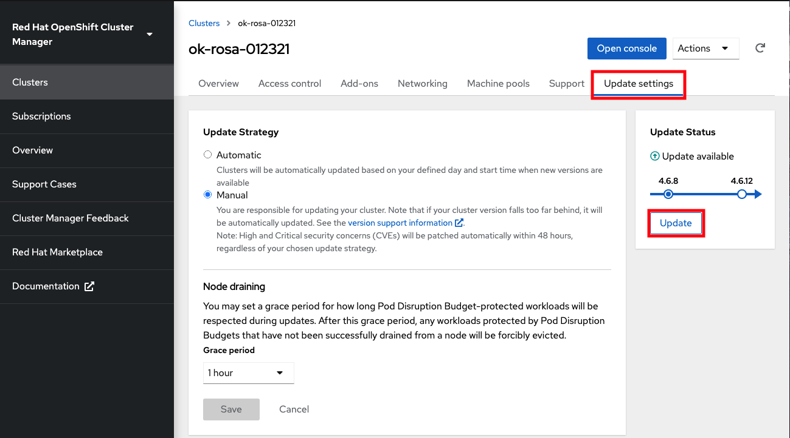

## Upgrading the cluster

There are 3 ways to upgrade your cluster.

- Manually via the CLI
- Manually via the OCM UI
- Automated upgrades

We will go through these three scenarios.

#### Manually via the CLI
1. Check if there is an upgrade available by running the following command

	`rosa list upgrade -c <cluster-name>` 

	You will get a list that shows the available version and the current version of your cluster.  For example:

    	$ rosa list upgrade -c <cluster-name>
    	VERSION  NOTES
    	4.6.15   recommended
    	4.6.13

    In our example we see that version 4.6.13 is available and so is 4.6.15.

1. Upgrade the cluster to the latest version by running

 	`rosa upgrade cluster -c my-cluster --version 4.6.15`

1. This will schedule the cluster for immediate upgrade.  It will take some time to complete.

#### Manually via OCM UI
1. To perform or upgrade via the UI log into OCM (<https://cloud.redhat.com/openshift>) and select the cluster you want to upgrade.
1. Click on the “Update Settings” tab
1. Click on the “Update” button

	

#### Set up automatic updates
1. To set up your cluster to be updated automatically log into OCM (<https://cloud.redhat.com/openshift>) and select the cluster you want to upgrade.
1. Click on the “Update Settings” tab.
1. Under “Update Strategy” click the “Automatic” radio button.
1. This will open up options for a day of the week and time that you can set for the update to occur.
1. Select a “Grace period” for allowing the nodes to gracefully drain before forcing the pod eviction under “Node draining”.
1. Click Save.

*[ROSA]: Red Hat OpenShift Service on AWS
*[IdP]: Identity Provider
*[OCM]: OpenShift Cluster Manager
